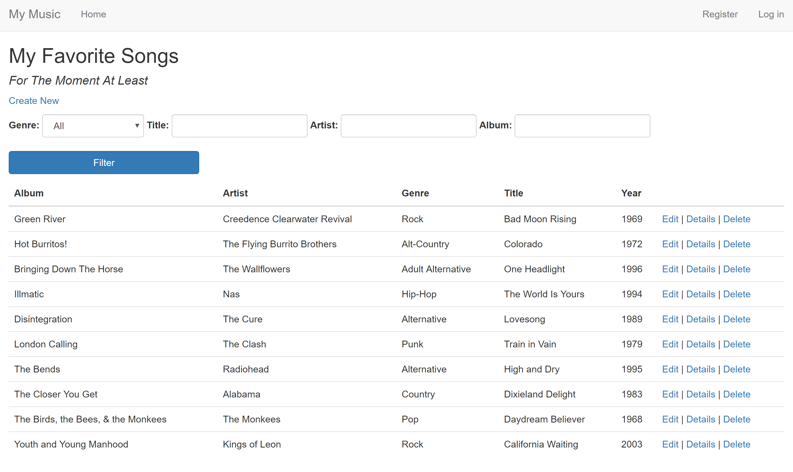

# FinalProject
Using C#, ASP.NET MVC, and Entity Framework Core to create a code first application.

Goals:
- Take an Entity Framework code first approach to designing a web application.
- Use simple database functionality to make a dynamic website that keeps track of a list of songs.
- Make the application be RESTful.
- Allow a user to use CRUD operations with the database from the web application.
- Apply a shared layout that renders the body with a Razor view within a common layout for the web app.
- Learn and apply the concepts of MVC while gaining experiencing in ASP.NET MVC Core and Entity Framework Core.
- Apply multiple options for filtering and searching capabilities.
- Create a layout that is responsive, mobile ready, and easy to use.

Here's the app from a desktop view:

