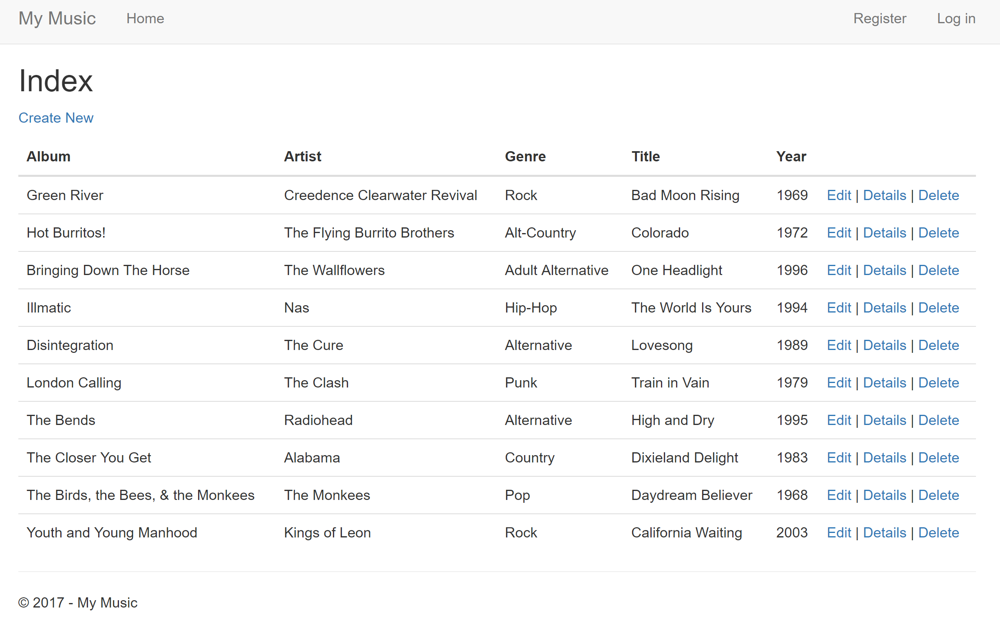

# FinalProject
Using C#, ASP.NET MVC, and Entity Framework Core to create a code first application.

Goals:
- Take a Entity Framework code first approach to designing a web application.
- Use simple database functionality to make a dynamic website that kept track of a list of songs.
- Allow a user to use CRUD operations with the database from the web application.
- Apply a shared layout that renders a body inside the layout rather than recreating it for every page.
- Learn and apply the concepts of MVC while gaining experiencing in ASP.NET MVC Core and Entity Framework Core.

